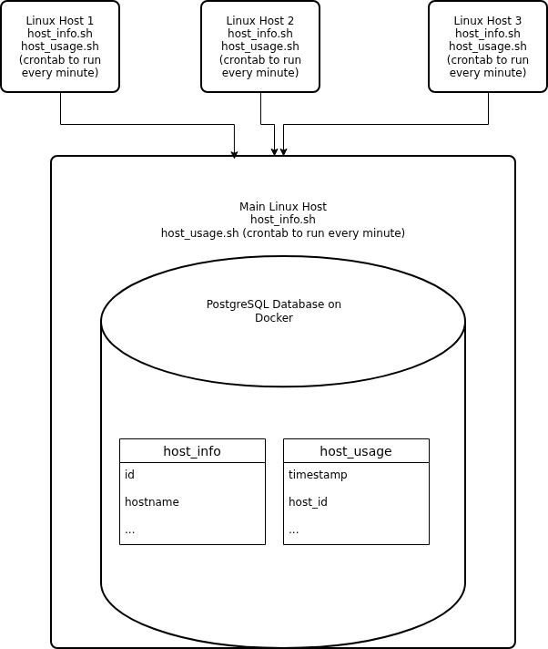

# Linux Cluster Monitoring Agent
# Introduction
The Linux Cluster Monitoring Agent is a program that helps collect information from Linux servers in a cluster. Specifically, it collects the server hardware information once and then in set intervals (such as every minute) collects the server's resource usage. Note that the only Linux distro that this has been tested on is for Rocky 9 Linux, but it may work for other distros. The data is collected by executing bash scripts that run Linux commands and then saving the data in a PostgreSQL database that's run on a Docker container. Git and GitHub have been used throughout the development of this project. Note that though the project is meant for collecting information across multiple servers and storing them in one database, the current version only works collect and stores the data inside the given server.

# Implementation
The tool works by setting up a psql docker container where the data for the server is collected. Thus, first both docker and the postgres image must be downloaded. The psql_docker.sh script is then used to create, start, and potentially stop the docker container for the tool. Then a database called host_agent is created in the container (data persists on the computer through a volume named pgdata) and the tables used for data storage are initialised as defined in ddl.sql.

The database is now ready so first the hardware information is inserted into the database using host_info.sh which uses Linux commands to extract information through the `lscpu` command and information in `/proc/cpuinfo` and `/proc/meminfo` files. This script must run first as an entry in the host_info database is needed to put an entry in the host_usage database. Then, the host_usage.sh is used to get the computer current resource usage into the database. This command can be automated to be run every minute or another time interval using the crontab command.


## Architecture
Visual diagram of a three Linux server cluster running the data collection agents and passing that information to a PostgreSQL database that's run on Docker



## Scripts
1. psql_docker.sh is used to create, start, and stop the postgres docker container

```./scripts/psql_docker.sh start|stop|create [db_username][db_password]```
2. host_info.sh is run once to collect the server's hardware information 

```./scripts/host_info.sh psql_host psql_port host_agent psql_user psql_password```
3. host_usage.sh is run to collect the server's resource usage information

```./scripts/host_usage.sh psql_host psql_port host_agent psql_user psql_password```
4. crontab is used to automate running commands over every given time interval

```
# edit the crontab jobs currently running
crontab -e

# add this command with your current path to crontab so that the script runs every minute
* * * * * bash [current_path]/host_usage.sh psql_host psql_port host_agent psql_user psql_password > /tmp/host_usage.log
```
5. ddl.sql is used to define the host_info and host_usage tables schema and create the tables in the host_agent database

```
psql -h localhost -U postgres -d host_agent -f sql/ddl.sql
```
## Database Modeling
### `host_info`

| Name | Data type | Short description                      |
|---|---|----------------------------------------|
| id | SERIAL | Auto-increment primary key             |
| hostname | VARCHAR | Name of the host machine (unique)      |
| cpu_number | INT2 | Number of CPU cores (vCPUs)            |
| cpu_architecture | VARCHAR | Type of CPU architecture               |
| cpu_model | VARCHAR | Human-readable CPU model name          |
| cpu_mhz | FLOAT8 | CPU frequency (MHz)                    |
| l2_cache | INT4 | L2 cache size (kB)                     |
| timestamp | TIMESTAMP | Time hardware data was collected (UTC) |
| total_mem | INT4 | Total system memory (kB)               |

### `host_usage`

| Name | Data type | Short description                               |
|---|---|-------------------------------------------------|
| timestamp | TIMESTAMP | Time usage data was collected (UTC)             |
| host_id | SERIAL | Foreign key that references `id` in `host_info` |
| memory_free | INT4 | Free memory amount (MB)                         |
| cpu_idle | INT2 | Percent of total CPU time in idle               |
| cpu_kernel | INT2 | Percent of total CPU time running kernel code   |
| disk_io | INT4 | Time spent doing I/O operations (seconds)       |
| disk_available | INT4 | Available disk space (MB)                       |

# Usage
1. Start a psql instance using psql_docker.sh given that you are currently in the linux_sql directory in the CLI (need to have docker already downloaded)
```
# get latest postgres image
docker pull postgres

# create the psql docker container used to store the data
./scripts/psql_docker.sh create psql_user psql_password

# start the psql container
./scripts/psql_docker.sh start

# [Optional] stop the psql container
./scripts/psql_docker.sh stop
```
2. Create the database and initialise its tables
```
# create the database
psql -h localhost -U postgres -d postgres -c "CREATE DATABASE host_agent;"

# initialise the tables
psql -h localhost -U postgres -d host_agent -f sql/ddl.sql
```
3. Insert server specs data into the database (can only do this once per server unless you manually eliminate the entry). This must be run first before running the host_usage.sh script.
```
# psql_port is probably 5432
./scripts/host_info.sh localhost psql_port host_agent psql_user psql_password
```
4. Insert server usage data into the database (can do this until the container is filled)
```
./scripts/host_usage.sh localhost psql_port host_agent psql_user psql_password
```
5. [Optional] Add repeated server usage data collection in a given time period
```
# edit the crontab jobs currently running
crontab -e

# add this command with your current path to crontab so that the script runs every minute
* * * * * bash [current_path]/host_usage.sh localhost psql_port host_agent psql_user psql_password > /tmp/host_usage.log

# list crontab jobs and check the logs after a minute to verify its working
crontab -l
cat /tmp/host_usage.log
```

# Test
Testing that the bash scripts and DDL files were working as intended was done via connecting to the psql container using `psql -h localhost -U postgres -d postgres -W`. There I've used `\l` to check that both the host_agent databases was there. I then connected to the host_agent database via `\c host_agent`. After, I ran `SELECT * FROM host_usage;` and `SELECT * FROM host_info;` to check if the data was properly inserted into the database and that the usage info was inserted every minute. 

Beyond keeping track that the data were inserted properly, I also used this process to make sure the unstandard way to running the sh scripts doesn't mess up the database. Specifically, making sure I could only insert into the host_info database once per machine and that host_usage table couldn't add new entries until host_info.sh was first ran before it. This testing did require clearing out the tables which I did by connecting the host_agent database and then running `TRUNCATE host_usage, host_info;`. The final result was that the scripts were working as intended.
# Deployment
The project files are located through GitHub with the development work being done in the development branch and separate feature branches for each feature that were merged to the development branch. The project must be deployed on a Linux server (only Rocky 9 has been tested but some other distros should work) where a docker container must be made to host the psql database. The first hardware information collection must be done manually but the host_usage.sh script can be automatically run for a given time interval through crontab.

# Improvements
- a way to update the server hardware data as the hardware in a server can change but there is currently no way to modify a host_info.sh entry other than manually doing so in the container
- the current version requires manual work to run the scripts so a single script to run them all and that would send that information to one server which contains the information for all the servers in one database
- a better UI to run these scripts would be beneficial for less technical users rather than running them through the CLI
