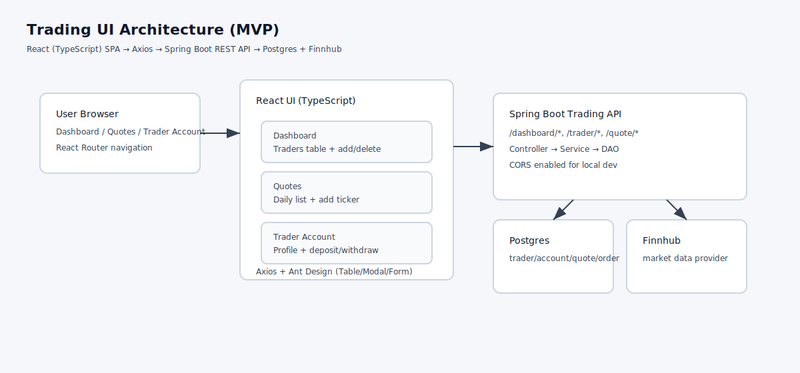

# Trading UI (React + TypeScript)

Note: This README is authored specifically for this repository and does not reuse content from any scrum board.

# Introduction
Trading UI is a small web dashboard for viewing and interacting with a trading backend. The app is aimed at internal users (e.g., a tester, developer, or operations staff) who need a simple way to inspect traders, check the daily quote cache, and perform basic account actions without calling REST endpoints manually. The UI is intentionally MVP-focused: it prioritizes clarity and fast feedback over complex workflows and deep analytics.

The frontend is built with React and TypeScript, using React Router for navigation, Ant Design for consistent UI components (tables, modals, forms), and Axios for HTTP requests. The backend is a Spring Boot service that exposes endpoints for trader management, quote listing, and account funding operations. The UI reads the backend base URL from `REACT_APP_BACKEND_URL` (defaulting to `http://localhost:8080`) so it can be pointed at a local Spring Boot instance or a Dockerized environment.

# Quick Start
Prerequisites:
- Docker (to run the backend + database)
- Node.js + npm (to run the frontend locally)

Backend (Docker):
```bash
# from repo root
cd springboot

# build backend image (Spring Boot)
docker build -t trading-app:local .

# build database image (Postgres schema + seed)
docker build -t trading-psql:local ./psql

# create a network so containers can communicate
docker network create trading-net || true

# start database (creates DB + tables from init.sql)
docker run --rm -d --name trading-psql --network trading-net \
  -e POSTGRES_DB=trading_app \
  -e POSTGRES_USER=postgres \
  -e POSTGRES_PASSWORD=password \
  trading-psql:local

# start backend (replace FINNHUB token)
docker run --rm -d --name trading-app --network trading-net -p 8080:8080 \
  -e PSQL_URL=jdbc:postgresql://trading-psql:5432/trading_app \
  -e PSQL_USER=postgres \
  -e PSQL_PASSWORD=password \
  -e FINNHUB_TOKEN=YOUR_TOKEN_HERE \
  trading-app:local
```

Frontend (local dev):
```bash
cd react/trading-ui

# point the UI at your backend (optional)
export REACT_APP_BACKEND_URL="http://localhost:8080"

npm install
npm start
```

Frontend (Docker):
```bash
cd react/trading-ui

# build a production image
docker build --build-arg REACT_APP_BACKEND_URL="http://localhost:8080" -t trading-ui:local .

# serve on http://localhost:3000
docker run --rm -p 3000:80 trading-ui:local
```

# Implementation
The UI is organized into pages and reusable components:
- Pages: `Dashboard`, `Quotes`, and `Trader Account` (details)
- Components: `NavBar` for navigation and `TraderList` for the traders table

The main user flows are:
- View traders: `GET /dashboard/traders`
- Create trader: `POST /trader/firstname/{...}/lastname/{...}/dob/{...}/country/{...}/email/{...}`
- Delete trader: `DELETE /trader/traderId/{traderId}`
- View quotes: `GET /quote/dailyList`
- Add quote by ticker: `POST /quote/tickerId/{ticker}`
- View trader account profile: `GET /dashboard/profile/traderId/{traderId}`
- Deposit/withdraw funds: `PUT /trader/deposit/...` and `PUT /trader/withdraw/...`

Ant Design forms are used for frontend validation (required fields, email format, and positive numeric amount checks). Errors are surfaced with toast messages for quick iteration during testing.

## Architecture


# Test
Frontend:
```bash
cd react/trading-ui
npm test -- --watchAll=false
npm run build
```

Manual smoke test checklist:
- Open `/dashboard` and verify trader list loads
- Create a trader and confirm it appears in the table
- Click a trader row and verify the Trader Account page loads
- Deposit funds, then withdraw funds, and confirm the balance changes
- Open `/quotes` and verify the daily quote list loads
- Add a quote by ticker and confirm it appears in the table

# Deployment
Source is managed in GitHub. Both services are containerized:
- Backend: built from `springboot/Dockerfile`
- Frontend: built from `react/trading-ui/Dockerfile` and served as a static SPA via Nginx

For production, typical next steps would include:
- pushing images to a registry (e.g., Docker Hub/ECR)
- running containers behind a reverse proxy (TLS + routing)
- injecting environment-specific backend URLs during the frontend build or via runtime configuration

# Improvements
- Add a dedicated “Refresh market data” action and better quote lifecycle management (e.g., remove ticker, update market data).
- Improve error handling by showing backend validation messages and mapping common failure cases (e.g., delete trader constraints).
- Add CI pipelines to build/test Docker images on every PR and publish versioned images on release tags.
