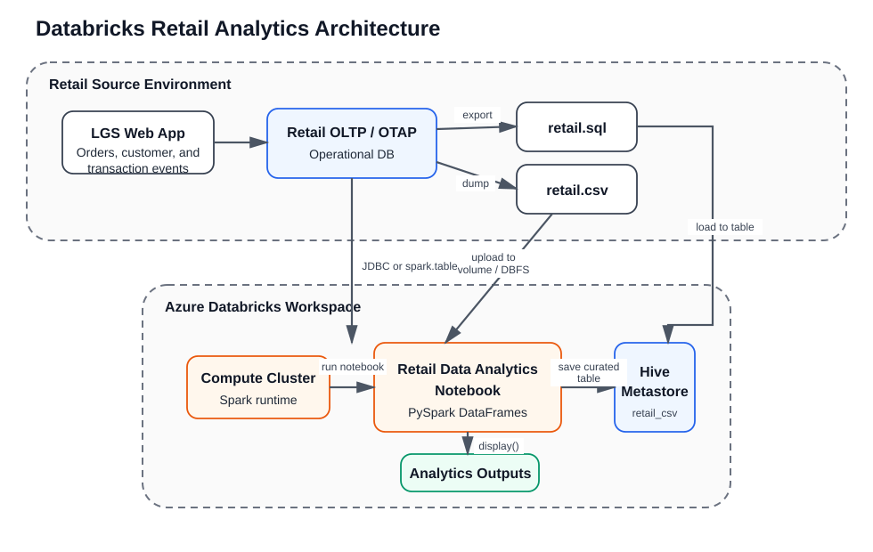
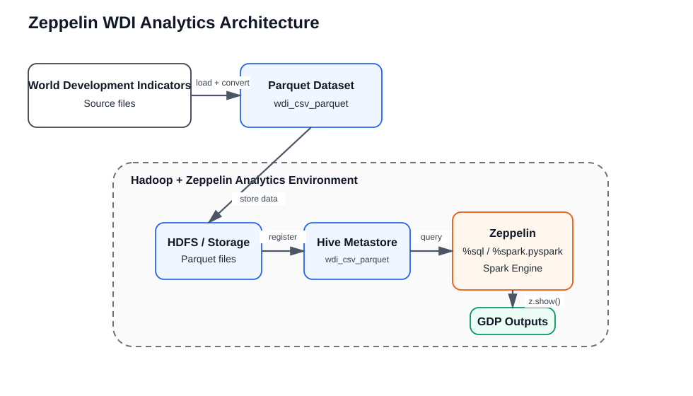

# Introduction
This project has two Spark-focused data analytics implementations. The first analyzes London Gift Shop retail transactions in Azure Databricks to transform raw order history into metrics about revenue, cancellations, active customers, repeat behavior, and customer segments. The second analyzes World Development Indicators in Zeppelin on a Hadoop-backed environment to compare Spark SQL and PySpark DataFrame workflows for GDP exploration.

My work was to build notebook-based analytics using PySpark and Spark structured APIs, persist curated data in the metastore, and document the end-to-end data flow in both Databricks and Zeppelin. The main technologies used across this project are Azure Databricks, DBFS, PySpark DataFrames, Spark SQL, Hive Metastore, Zeppelin, Hadoop ecosystem storage, and notebook-driven analytics.

# Databricks and Hadoop Implementation
For the Databricks implementation, I used the `online_retail_II.csv` retail transaction dataset and re-implemented the analytics workflow from the original Pandas notebook in PySpark. The notebook cleans the raw schema, casts data types, creates reusable analytics columns, and computes invoice amount distribution, monthly placed and canceled orders, monthly sales, monthly sales growth, monthly active users, new versus existing users, and RFM segmentation. The notebook is here: [Retail Data Analytics with PySpark.ipynb](./notebook/Retail%20Data%20Analytics%20with%20PySpark.ipynb).

The architecture uses Azure Databricks as the compute layer and either a metastore table, JDBC connection, or file landing path as the ingestion source. In the notebook, Spark reads the retail data, standardizes the schema with PySpark DataFrames, and writes the curated analytics table into the Hive Metastore for reuse. Aggregated analytics DataFrames are then displayed directly in the notebook with Databricks `display(...)`, which keeps the workflow interactive while still using distributed Spark execution. This design is lightweight for notebook experimentation, but it also leaves room to move the raw file landing step into Azure Storage or JDBC ingestion when the dataset grows.

# Zeppelin and Hadoop Implementation
For the Zeppelin implementation, I used the World Development Indicators dataset stored as a Parquet-backed Hive table and analyzed GDP-related indicators with both Spark SQL and PySpark DataFrames. The work includes listing metastore tables, reading the `wdi_csv_parquet` table into Spark, showing historical GDP for Canada, sorting GDP by country and year, and finding the highest GDP observation for each country. The notebook is here: [Spark Dataframe - WDI Data Analytics.ipynb](./notebook/Spark%20Dataframe%20-%20WDI%20Data%20Analytics.ipynb).

The Zeppelin architecture uses a Hadoop-based analytics environment with Spark connected to the Hive Metastore. The Parquet dataset is stored in the cluster storage layer, registered as a Hive table, and queried through both `%sql` and `%spark.pyspark` interpreters inside Zeppelin. This makes it easy to compare SQL-style and DataFrame-style analytics side by side while still running on the same Spark engine. Zeppelin visualization helpers such as `z.show(...)` are used to inspect intermediate and final result sets.

# Future Improvement
- Add a reproducible ingestion pipeline that automatically lands retail and WDI source data into cloud storage and refreshes Hive tables without manual notebook steps.
- Export notebook outputs into curated reporting tables so downstream dashboards can consume stable analytics results.
- Expand the Databricks implementation to use external Azure Storage and scheduled jobs instead of only notebook-triggered execution.
- Extend the Zeppelin WDI analysis beyond GDP into multiple indicators, richer joins, and parameterized notebook inputs for country and year selection.
